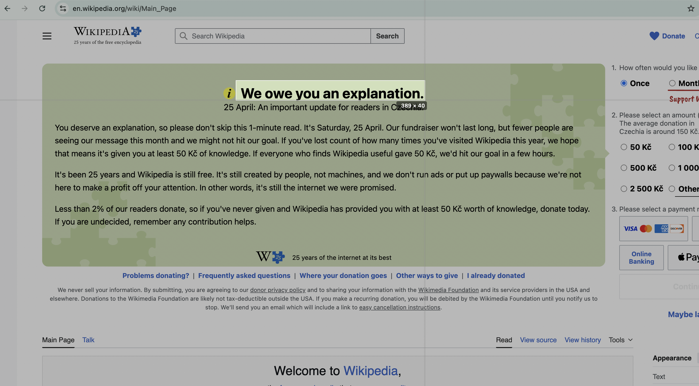
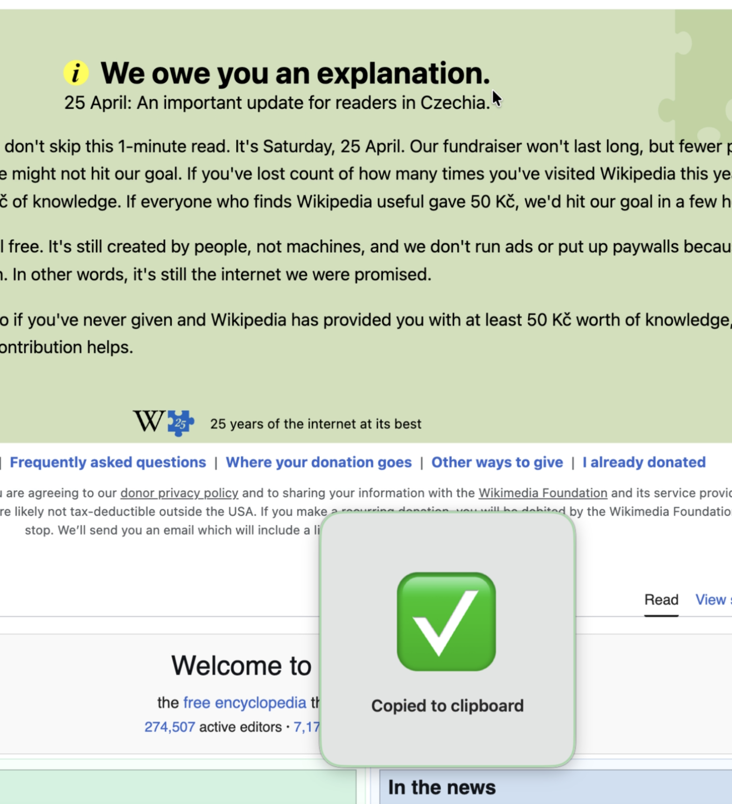
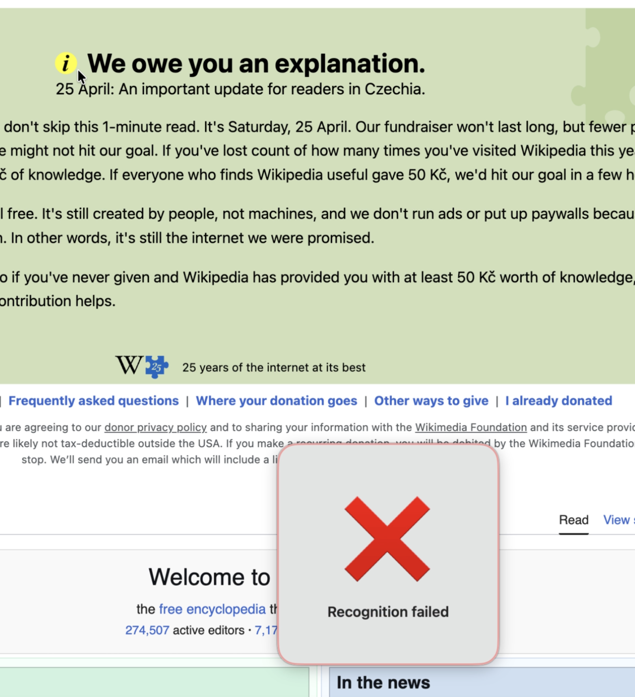

# KV-TextSniper

Menu-bar OCR for macOS. Press a hotkey, drag a region, get the text in your clipboard.

  

## Install

[**⬇ Download KV-TextSniper.dmg**](https://slava-konashkov.github.io/KV-TextSniper/KV-TextSniper.dmg) (always the latest, ≈700 KB).

Drag `KV-TextSniper.app` into `/Applications`, launch, and grant **Screen Recording** permission in *System Settings → Privacy & Security → Screen Recording* the first time you capture. The DMG is signed with a Developer ID and notarised by Apple — no Gatekeeper warning, no `xattr` workaround.

The default hotkey is **⌘⇧9**. Change it in **Settings…** from the menu-bar menu.

## What it does

- Lives in the menu bar — no Dock icon, no clutter.
- Global hotkey brings up a passive selection overlay; drag any region of the screen.
- OCR runs locally on-device via Apple's **Vision** framework. No network, no accounts, no telemetry.
- Auto-detects language: Latin, Cyrillic, Chinese (Simplified + Traditional), Japanese, Korean, Arabic, and more — depending on the macOS version.
- Result lands on the clipboard and a small confirmation banner appears.
- Universal binary — runs natively on Apple Silicon and Intel Macs.

  

## Selection mode

The selection overlay is **passive** — it doesn't steal focus from the app you're capturing. That means you can capture transient UI elements (Telegram media previews, Spotlight-style panels, the macOS emoji picker) without them auto-dismissing on focus loss.

Cross-screen alignment guides at the cursor make it easy to align the rectangle with text edges. Cancel with **Escape** or **right-click**.

## When OCR fails

OCR works best on text that's at least ~12 pt and has reasonable contrast against its background. If recognition fails (low contrast, tiny text, decorative font, heavy compression artefacts), KV-TextSniper shows a brief failure banner and discards the capture — nothing else happens.

  

## Requirements

- macOS 13 Ventura or later
- Apple Silicon or Intel (universal binary)
- Screen Recording permission (granted on first capture)

## Privacy

The app makes **no** network calls, has no accounts, and stores nothing beyond your selected hotkey + a couple of toggles in `UserDefaults`. Captured pixels are processed in memory by Apple's Vision framework on your Mac and discarded. Full policy: [PRIVACY.html](https://slava-konashkov.github.io/KV-TextSniper/PRIVACY.html).

---

*Sources live in a separate private repo. This public repo only carries the README, privacy policy, and the latest DMG so the download URL stays stable across versions. See all KV-* apps at [github.com/slava-konashkov](https://github.com/slava-konashkov).*
